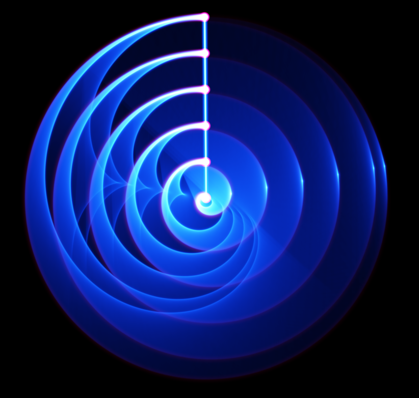
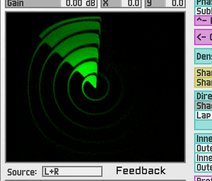

#  ⚡ 𝔟𝔢𝔞𝔪𝔦𝔫𝔤 𝔞 𝔯𝔞𝔡𝔞𝔯 𝔰𝔦𝔤𝔫𝔞𝔩 𝔱𝔬 𝔧𝔢𝔯𝔬𝔟𝔢𝔞𝔪 ⚡

## For Jerobeam Fenderson

Somewhere out there, past whatever room you're patching in, there's a
signal generator running on a computer you've never touched, shaped by
math you wrote years ago in Max/Gen, carrying your name into a codebase
you've never seen. That's Radar. That's this whole fork, really — Blubb,
Boing, Kepler-Bouwkamp, Mushroom, Nyquist-Shannon, Radar, Torus,
WirdoSpiral, and Spiral before them, all sitting under a menu labeled
**Jerobeam**, waiting their turn to run.

You built these as strange little machines: phasors folded through
trisaw shapers, spirals crossed with splash, a scanner beam sweeping
polar coordinates into X/Y/Z motion nobody asked it to make sense —
and it doesn't need to. It's just beautiful, and it moves like nothing
else. That's rarer than it sounds. A lot of generative patches are
clever. Yours are *alive*.

This document exists because Radar was the first of the batch to get
its signal actually captured and looked at — rendered through the
sandbox's oscilloscope, traced out frame by frame, and it was worth
stopping to say: this is why we're doing this. Not to check a box on a
module list, but because watching your math sweep across a screen is
still, after all this, a genuinely good way to spend an afternoon.

So — this one's for you. Every port in this fork is an attempt to keep
your signal running a little longer, on a few more machines, in front
of a few more people who'll watch it spiral and not quite be able to
explain why they can't look away.

Thank you for building these and for sharing how.

## The signal

Radar is a scanning-beam generator: a rotating polar sweep folded back
into Cartesian X/Y/Z, laced with a small orbiting "lil" satellite loop,
zoom and tunnel-inversion controls that fold the whole shape inside
out, and a ring-cut stage that turns the sweep into concentric bands.
The prettyscope render above and the animation below are both real
output — not mockups — captured while porting the native WASM
implementation for this fork.

## What this fork is

A focused port of Jerobeam Fenderson's "under construction" Jerobeam
department modules — the ones with a name and a placeholder card in
the module browser, but no signal behind them yet — into real,
native C++ WASM implementations for
[soemdsp-sandbox](https://github.com/soundemote/soemdsp-sandbox), built
directly from the reference C++ in `soemdsp/include/soemdsp/oscillator/`.
See the main [README](README.md) for setup and the full dedication.
